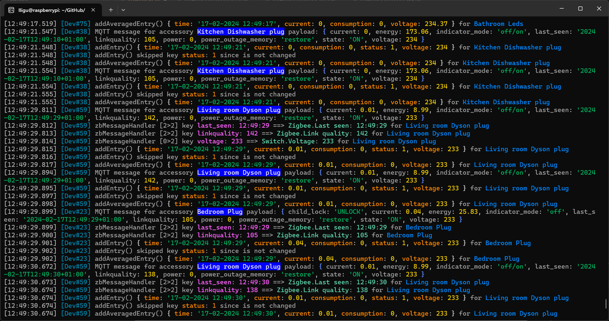

# NodeStorage

CLogger is a lightweight, customizable color logger for Node.js. 

## Features

- Simple and intuitive API for data logging.
- Customizable colors and apperance.
- Includes also a color customizable stringify funtions.

## Getting Started

### Prerequisites

- Node.js installed on your machine.
- Basic knowledge of TypeScript and Node.js.

### Installation

To get started with NodeStorage in your package

```bash
npm install node-color-logger
```

# Usage

## Initializing NodeStorageManager:

Create an instance of CLogger.

```
import { CLogger } from 'node-color-logger';
```

```
const log = new CLogger();
```

## Using the logger:

```
log.debug('Debug message...', ..., ..., ...);
log.info('Info message...', ..., ..., ...);
log.warn('Warning message', ..., ..., ...);
log.error('Error message', ..., ..., ...);
```

# Screenshot



# Contributing

Contributions to CLogger are welcome.

# License

This project is licensed under the MIT License - see the LICENSE file for details.